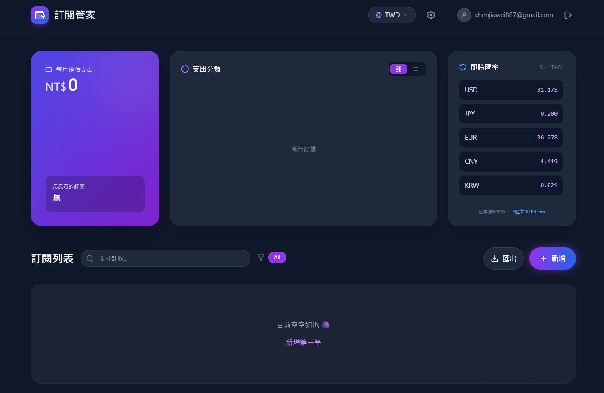

# ⚡ 訂閱管家 (Subscription Tracker)

> 別再讓閒置的訂閱悄悄偷走你的錢。集中管理 Netflix, Spotify, AWS 等所有支出，掌握你的財務自由。


*(建議：你可以把你的 Dashboard 截圖放在 public 資料夾並命名為 dashboard-preview.png，這樣這裡就會顯示)*

## ✨ 專案特色

這是一個採用現代化技術堆疊構建的 **SaaS 等級訂閱管理系統**，具備以下核心功能：

- **🎨 Cyberpunk Neon 風格 UI**：全站深色模式、玻璃擬態 (Glassmorphism)、流暢的 Framer Motion 動畫。
- **📊 視覺化財務儀表板**：自動計算每月/每年固定支出，透過甜甜圈圖分析消費類別佔比。
- **🌍 多幣別即時匯率**：串接 Exchange Rate API，支援 TWD, USD, JPY, EUR 等多國貨幣即時換算。
- **📅 訂閱行事曆**：直觀的月曆視圖，一眼看出哪天需要扣款。
- **🔐 完整的會員系統**：
  - 支援 Email 註冊/登入。
  - 支援 Google OAuth 第三方登入。
  - 忘記密碼流程 (整合 Resend 寄送精美 HTML 郵件)。
- **👤 個人化設定**：
  - 支援大頭貼上傳與裁切 (React Easy Crop + Supabase Storage)。
  - 個人資料修改。
- **📥 資料匯出**：支援一鍵匯出 CSV 報表，方便進行 Excel 進階記帳。

## 🛠️ 技術棧 (Tech Stack)

- **前端框架**: [Next.js 14](https://nextjs.org/) (App Router)
- **程式語言**: [TypeScript](https://www.typescriptlang.org/)
- **樣式與動畫**: [Tailwind CSS](https://tailwindcss.com/), [Framer Motion](https://www.framer.com/motion/)
- **後端與資料庫**: [Supabase](https://supabase.com/) (PostgreSQL, Auth, Storage)
- **郵件服務**: [Resend](https://resend.com/)
- **圖表庫**: [Recharts](https://recharts.org/)
- **工具庫**: Lucide React, React Datepicker, React Calendar

## 🚀 快速開始 (Getting Started)

### 1. 複製專案
```bash
git clone [https://github.com/你的帳號/subscription-tracker.git](https://github.com/你的帳號/subscription-tracker.git)
cd subscription-tracker
```

### 2. 安裝依賴
```bash
npm install
```

### 3. 設定環境變數
請在專案根目錄建立 `.env.local` 檔案，並填入以下資訊：

```env
# Supabase Configuration
NEXT_PUBLIC_SUPABASE_URL=你的_Supabase_Project_URL
NEXT_PUBLIC_SUPABASE_ANON_KEY=你的_Supabase_Anon_Key
SUPABASE_SERVICE_ROLE_KEY=你的_Supabase_Service_Role_Key (用於後端 API)

# Resend Email Configuration
RESEND_API_KEY=re_你的_Resend_API_Key
```

### 4. 資料庫設定 (Supabase SQL)
請在 Supabase 的 SQL Editor 執行以下指令以建立必要的表格與權限：

```sql
-- 1. 建立訂閱表格
create table subscriptions (
  id uuid default uuid_generate_v4() primary key,
  user_id uuid references auth.users not null,
  name text not null,
  price numeric not null,
  currency text default 'TWD',
  billing_cycle text not null,
  start_date date not null,
  next_payment_date date,
  category text,
  created_at timestamp with time zone default timezone('utc'::text, now()) not null
);

-- 2. 建立使用者資料表
create table profiles (
  id uuid references auth.users on delete cascade primary key,
  email text,
  display_name text,
  avatar_url text,
  updated_at timestamp with time zone
);

-- 3. 開啟 RLS (Row Level Security) 並設定權限
alter table subscriptions enable row level security;
alter table profiles enable row level security;

-- (這裡省略詳細 Policy 設定，請參考開發文件或 Supabase 文檔)
```

### 5. 啟動開發伺服器
```bash
npm run dev
```
打開瀏覽器訪問 `http://localhost:3000` 即可看到成果！

## 📝 專案結構

```
├── app/
│   ├── api/            # 後端 API (如寄信功能)
│   ├── auth/           # 認證 callback 與重設密碼頁面
│   ├── dashboard/      # 主控台頁面
│   ├── login/          # 登入註冊頁
│   ├── settings/       # 個人設定頁
│   ├── globals.css     # 全域樣式 (含霓虹特效設定)
│   └── layout.tsx      # 網站佈局
├── components/         # 共用元件
├── lib/                # 工具函式 (Supabase client, Canvas utils)
└── public/             # 靜態資源
```

## 📄 License

此專案僅供學習與作品集展示使用。