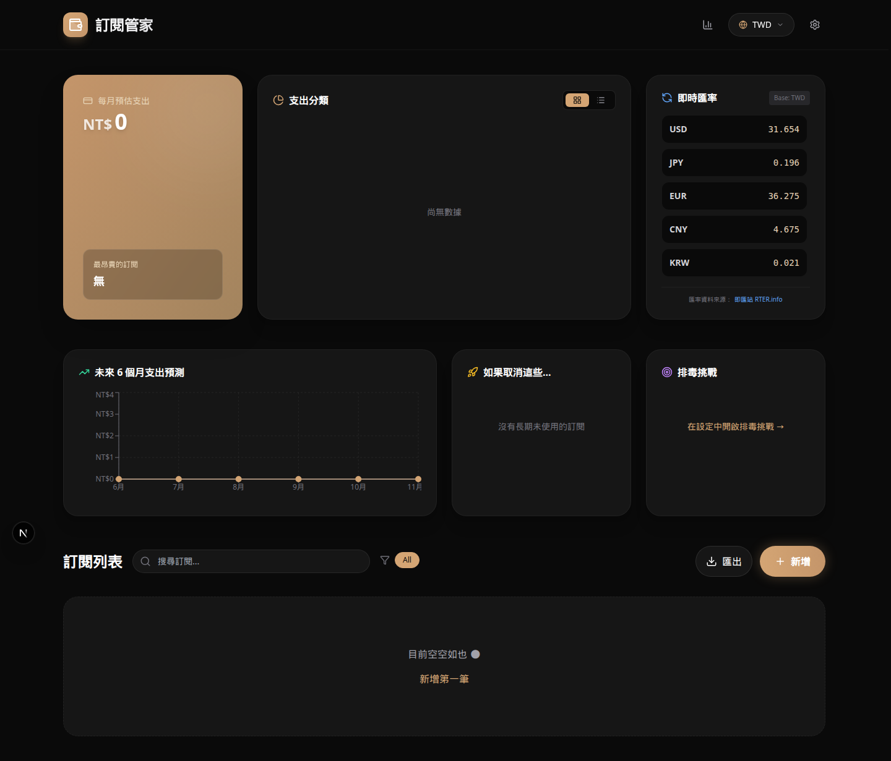

# 訂閱管家 (Subscription Tracker)

掌握每一筆訂閱支出。Netflix、Spotify、Disney+ 到 iCloud、Microsoft 365 — 一個地方集中管理，自動計算每月開銷，支援多幣別即時換算，以及預算管控、試用到期提醒、取消排毒挑戰等進階功能。



## Features

- **儀表板** — 每月總支出、類別佔比圓餅圖、6 個月支出預測曲線、即時匯率牌價
- **預算管控** — 設定每月上限，超支自動警示，進度條一目瞭然
- **多幣別** — TWD / USD / JPY / KRW / CNY / EUR，Exchange Rate API 即時換算
- **試用 / 優惠追蹤** — 輸入試用到期日或促銷截止日，卡片上自動倒數計時（<3 天醒目提示）
- **使用頻率追蹤** — 記錄最後使用日期，超過 60 天未用自動標示為閒置訂閱
- **分攤計算** — 與家人朋友共享的訂閱，輸入共享人名單，自動算出每人分攤金額
- **年度回顧** — 年支出總額、月均、類別長條圖，一鍵檢視
- **排毒挑戰** — 設定目標取消數量，儀表板顯示進度條，達標獲得榮譽獎盃
- **綑綁偵測** — 自動比對 Apple One、Microsoft 365、Google One 等組合，提示合併建議
- **行事曆** — 月曆視覺化顯示所有扣款日期
- **取消引導** — 每張卡片直接連結各平台的取消訂閱頁面
- **通知設定** — 可設定 Email 扣款提醒（需自行配置 Supabase + Resend）
- **CSV 匯出** — 一鍵匯出報表，含多幣別換算金額

## Tech Stack

| Layer | Tech |
|-------|------|
| Framework | Next.js 16 + React 19 |
| Language | TypeScript (strict) |
| Styling | Tailwind CSS 3.4 |
| Animation | Framer Motion |
| Charts | Recharts |
| Icons | Lucide React + 27 official brand SVGs |
| Font | Plus Jakarta Sans (next/font) |
| Storage | localStorage |
| Exchange Rates | open.er-api.com |

## Getting Started

```bash
npm install
npm run dev
```

Open `http://localhost:3000`

### Commands

| Command | Action |
|---------|--------|
| `npm run dev` | Development server |
| `npm run build` | Build + TypeScript check |
| `npm run lint` | ESLint (flat config, v9) |
| `npm start` | Production server |

## Design

Gold Glass 風格 — 深色底 (`#0A0A0A`)、玻璃感卡片 (`#161616`)、主色 `#D4A574` 金屬暖金。

所有品牌圖示以官方 SVG 存放於 `public/icons/`，使用 `next/image` 渲染，針對深色背景手動調整暗色圖示的填色。

## 專案結構

```
├── app/
│   ├── api/send-reminders/   # Email 提醒 API（需 Supabase + Resend env）
│   ├── dashboard/             # 儀表板主頁
│   ├── settings/              # 設定頁
│   ├── globals.css
│   └── layout.tsx
├── components/
│   └── SubscriptionCard.tsx   # 訂閱卡片（含倒數、分攤、使用追蹤）
├── lib/
│   └── storage.ts             # localStorage 存取層
├── public/icons/              # 27 個官方品牌 SVG
└── types/
    └── index.ts               # Subscription, BudgetSettings, DetoxChallenge
```

## License

僅供學習與作品集展示使用。
