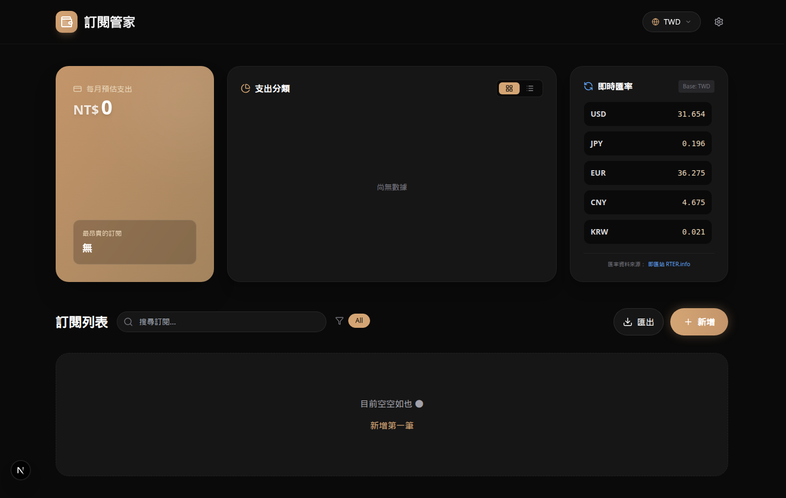

# 訂閱管家 (Subscription Tracker)

集中管理 Netflix、Spotify 等所有訂閱支出，自動計算每月花費、多幣別換算，掌握你的財務自由。



## 功能

- **📊 儀表板** — 每月總支出、類別佔比圓餅圖、即時匯率
- **🌍 多幣別** — 支援 TWD/USD/JPY/KRW/CNY/EUR，即時換算
- **📅 行事曆** — 月曆視圖一眼看出扣款日
- **🔔 通知設定** — 預設關閉，可在設定中開啟
- **📥 CSV 匯出** — 一鍵匯出報表
- **💾 本地儲存** — 所有資料存在瀏覽器 localStorage，無需註冊

## Tech Stack

| 層 | 技術 |
|---|------|
| 框架 | Next.js 16 + React 19 |
| 語言 | TypeScript strict |
| 樣式 | Tailwind CSS 3.4 |
| 動畫 | Framer Motion |
| 圖表 | Recharts |
| 圖示 | Lucide React + 自訂 SVG (public/icons/) |
| 圖標 | 27 個官方品牌 SVG 圖示 |
| 字體 | Plus Jakarta Sans (next/font) |
| 資料 | localStorage |
| 匯率 | Exchange Rate API (open.er-api.com) |

## 快速開始

```bash
npm install
npm run dev
```

開啟 `http://localhost:3000`

## 命令

| 命令 | 用途 |
|------|------|
| `npm run dev` | 開發伺服器 |
| `npm run build` | 建置 + TypeScript 檢查 |
| `npm run lint` | ESLint (flat config) |
| `npm start` | 正式伺服器 |

## 設計

Emerald Glass 風格 — 深色背景 (`#09090b`)、玻璃卡片 (`#18181b`)、主色 emerald-500／cyan-500。

品牌圖示以 `public/icons/*.svg` 存放，使用官方品牌路徑，僅針對暗色背景調整填色。所有圖示以 `<Image width={24} height={24}>` 統一渲染。

## 專案結構

```
├── app/
│   ├── api/send-reminders/   # 寄信 API（需 Supabase + Resend env）
│   ├── dashboard/            # 主控台
│   ├── settings/             # 個人設定
│   ├── globals.css           # 全域樣式
│   └── layout.tsx            # 佈局
├── components/
│   └── SubscriptionCard.tsx  # 訂閱卡片元件 + POPULAR_SERVICES
├── lib/
│   └── storage.ts            # localStorage 讀寫層
├── public/icons/             # 27 個官方品牌 SVG
└── types/
    └── index.ts              # Subscription interface
```

## License

僅供學習與作品集展示使用。
